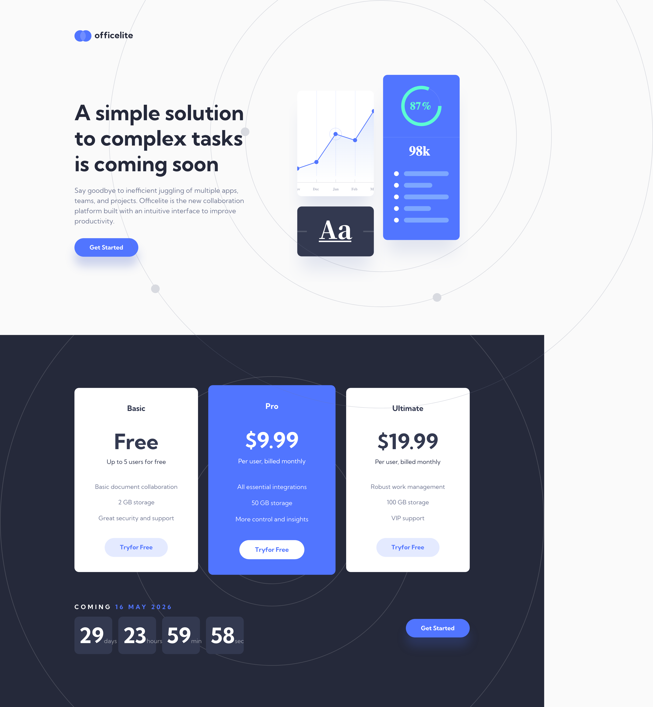
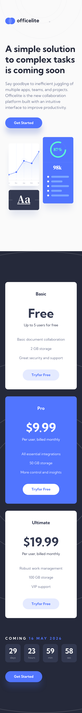
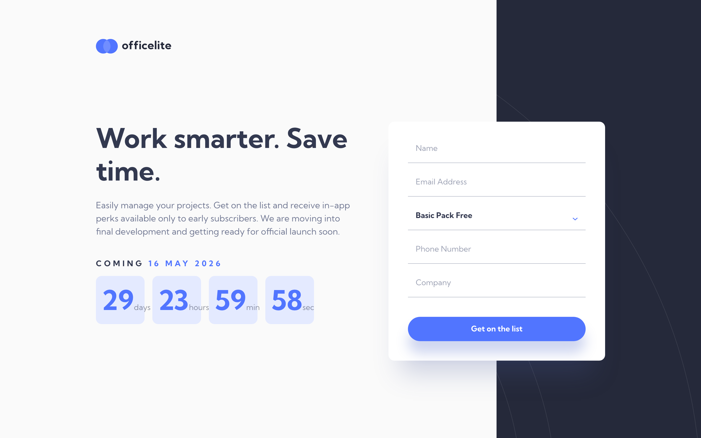
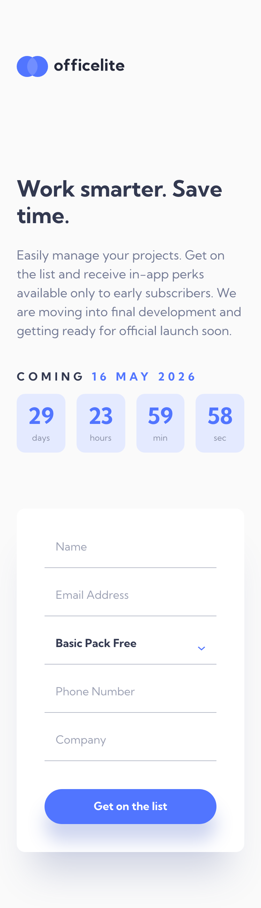

# Officelite — Coming Soon Site

A responsive coming-soon landing page for **Officelite**, a fictional collaboration platform. Features a live 30-day launch countdown, three pricing tiers, and a validated sign-up form with a custom-styled `select`. Built from a Figma design as a solution to the [Frontend Mentor challenge](https://www.frontendmentor.io/challenges/officelite-coming-soon-site-M4DIPNz8g).


## Table of Contents

- [Overview](#overview)
  - [The Challenge](#the-challenge)
  - [Links](#links)
- [Screenshots](#screenshots)
- [Built With](#built-with)
- [Installation](#installation)
- [Quick Start](#quick-start)
- [Project Structure](#project-structure)
- [What I Learned](#what-i-learned)
- [AI Collaboration](#ai-collaboration)
- [Roadmap](#roadmap)
- [License](#license)
- [Author](#author)

## Overview

### The Challenge

Users should be able to:

- View the optimal layout depending on their device's screen size
- See hover states for all interactive elements
- See error states when the sign-up form is submitted if:
  - The `Name` and/or `Email Address` fields are empty
  - The `Email Address` is not formatted correctly
- **Bonus:** See a live countdown timer that ticks down every second
- **Bonus:** See a custom-styled `select` form control in the sign-up form

### Links

- **Live site:** https://fsdev-officelite-coming-soon-site-d.vercel.app
- **Source code:** https://github.com/gusanchefullstack/fsdev-officelite-coming-soon-site
- **Challenge:** https://www.frontendmentor.io/challenges/officelite-coming-soon-site-M4DIPNz8g

## Screenshots

#### Home — Desktop (1440px)


#### Home — Mobile (375px)


#### Sign-up — Desktop (1440px)


#### Sign-up — Mobile (375px)


## Built With

- Semantic HTML5 markup
- CSS custom properties (design tokens)
- CSS Grid & Flexbox
- Fluid typography & spacing with `clamp()`
- Vanilla JavaScript (ES modules) — no frameworks
- Mobile-first responsive workflow
- [Vite](https://vitejs.dev/) — dev server & build tool

## Installation

**Prerequisites**
- Node.js **>= 18**
- npm **>= 9**

```bash
git clone git@github.com:gusanchefullstack/fsdev-officelite-coming-soon-site.git
cd fsdev-officelite-coming-soon-site
npm install
```

## Quick Start

```bash
npm run dev        # Start Vite dev server (http://localhost:5173)
npm run build      # Build production bundle to dist/
npm run preview    # Preview the production build locally
```

## Project Structure

```
src/
├── index.html          # Home page (hero + pricing)
├── sign-up.html        # Sign-up form page
├── scripts/
│   ├── main.js         # Entry: wires up countdown + form
│   ├── countdown.js    # 30-day launch countdown (persisted in localStorage)
│   └── form.js         # Client-side validation + custom select
└── styles/
    ├── _tokens.css     # Design tokens: colors, type, spacing, radius
    ├── _reset.css      # Modern CSS reset
    ├── _base.css       # Global element styling
    ├── _components.css # Shared UI (buttons, cards, form controls)
    ├── _home.css       # Home page layout
    ├── _signup.css     # Sign-up page layout
    └── main.css        # Aggregates all partials
assets/                 # Images, SVGs, favicons
screenshots/            # Responsive screenshots for this README
```

## What I Learned

Key takeaways from building this project:

- **Design tokens as CSS variables.** Colors, typography, spacing, and radius live in `_tokens.css` as a single source of truth — theme tweaks become one-line changes.
- **Persisted countdown.** A 30-day launch date is computed once and stored in `localStorage`, so the timer survives reloads and remains consistent across navigations. Wrapped in `try/catch` because `localStorage` can throw in private/incognito modes.
- **Accessible custom select.** A native `<select>` styled with a background-image arrow keeps screen-reader and keyboard support for free — no custom widget required.
- **Fluid responsive sizing.** `clamp()` for type and spacing removes several breakpoints and produces smoother scaling between 375px and 1440px.
- **Accessibility details that matter.** `:focus-visible` rings, `role="list"` on the countdown, disambiguated link text (WCAG 2.4.4), and `checkValidity()` on the email input — all add up to a form that works for everyone.

External references that helped:

- [MDN — Using CSS custom properties](https://developer.mozilla.org/en-US/docs/Web/CSS/Using_CSS_custom_properties)
- [web.dev — `:focus-visible`](https://web.dev/articles/focus-visible)
- [WCAG 2.4.4 — Link Purpose (In Context)](https://www.w3.org/WAI/WCAG21/Understanding/link-purpose-in-context.html)
- [MDN — Constraint Validation API](https://developer.mozilla.org/en-US/docs/Web/HTML/Constraint_validation)

## AI Collaboration

Built with Claude Code (Anthropic) assistance: design tokens and component structure were extracted from the Figma file via the Figma MCP server; markup, CSS, and JS were authored through pair-programming; responsive tuning and the commit breakdown were planned collaboratively.

## Roadmap

- [x] Home page (hero + pricing tiers)
- [x] Sign-up page with client-side validation
- [x] Live 30-day launch countdown
- [x] Responsive layouts for 375px / 768px / 1440px
- [x] Accessibility pass (focus-visible, contrast, semantic landmarks)
- [x] Deploy to Vercel
- [ ] Persist form submissions to a backend
- [ ] Add Lighthouse CI to track perf/a11y on every PR

## License

Distributed under the MIT License.

## Author

**Gustavo Sanchez Galarza**

[](https://www.linkedin.com/in/gustavosanchezgalarza/)
[](https://github.com/gusanchefullstack)
[](https://hashnode.com/@gusanchedev)
[](https://x.com/gusanchedev)
[](https://bsky.app/profile/gusanchedev.bsky.social)
[](https://www.freecodecamp.org/gusanchedev)
[](https://www.frontendmentor.io/profile/gusanchefullstack)
